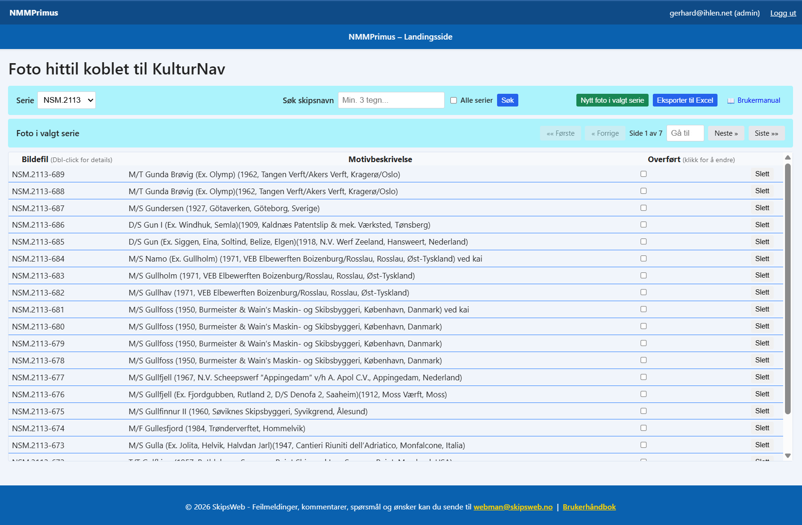
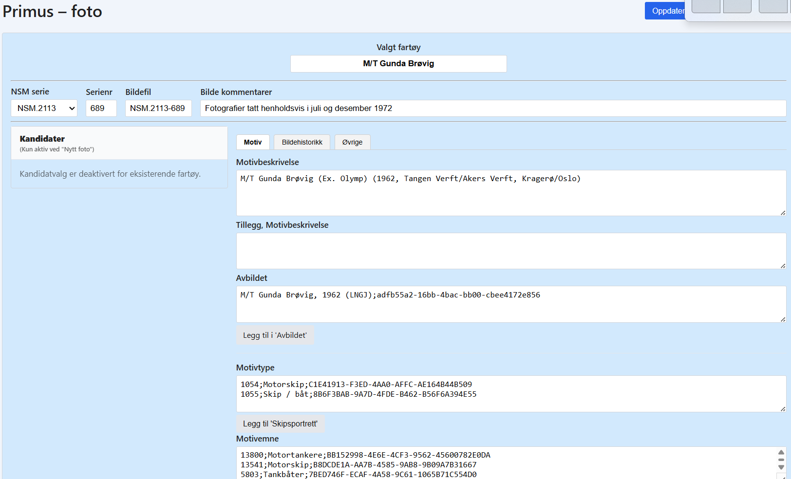
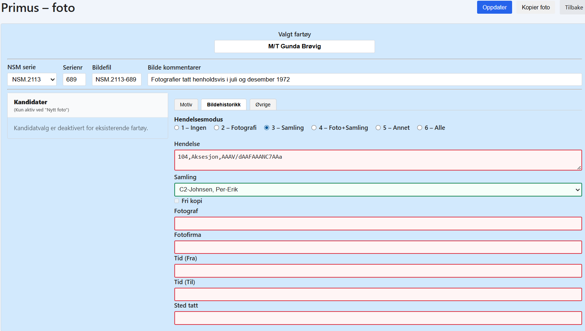
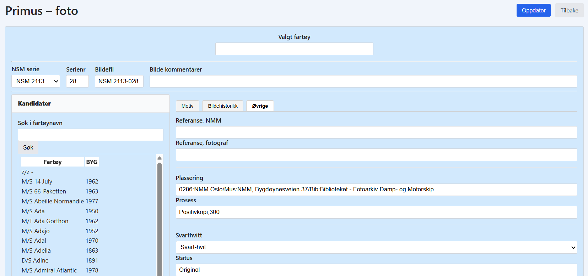

# NMMPrimus Brukerhåndbok

**Versjon:** 1.0
**Dato:** 2026-01-21
**System:** NMMPrimus - Maritim fotoarkiv-forvaltning

---

## Innholdsfortegnelse

1. [Innledning](#1-innledning)
2. [Kom i gang](#2-kom-i-gang)
3. [Landingssiden (Hovedoversikt)](#3-landingssiden-hovedoversikt)
4. [Detaljvisning (Redigering av foto)](#4-detaljvisning-redigering-av-foto)
5. [Arbeidsflyt: Opprette nytt foto](#5-arbeidsflyt-opprette-nytt-foto)
6. [Arbeidsflyt: Redigere eksisterende foto](#6-arbeidsflyt-redigere-eksisterende-foto)
7. [Arbeidsflyt: Kopiere foto](#7-arbeidsflyt-kopiere-foto)
8. [Hendelsesmodus (iCh 1-6)](#8-hendelsesmodus-ich-1-6)
9. [Eksport til Excel (kun admin)](#9-eksport-til-excel-kun-admin)
10. [Brukeradministrasjon (kun admin)](#10-brukeradministrasjon-kun-admin)
11. [Ofte stilte spørsmål](#11-ofte-stilte-spørsmål)
12. [Feilsøking](#12-feilsøking)

---

## 1. Innledning

### Hva er NMMPrimus?

NMMPrimus er et webbasert system for forvaltning av Norsk Maritimt Museums fotoarkiv. Systemet erstatter den tidligere Microsoft Access-løsningen og gjør det mulig å:

- Registrere og katalogisere maritime fotografier
- Koble fotodata med fartøyinformasjon fra fartøyregisteret
- Organisere foto i bildeserier
- Spore bildehistorikk, fotografer og samlingsinformasjon
- Eksportere fotodata til Excel for videre behandling

### Roller

Systemet har to brukerroller:

- **Bruker**: Kan registrere, redigere og slette foto. Kan søke i fartøyregisteret.
- **Admin**: Har alle brukerrettigheter pluss tilgang til brukeradministrasjon og Excel-eksport.

---

## 2. Kom i gang

### Innlogging

1. Åpne NMMPrimus i nettleseren
2. Logg inn med din e-postadresse og passord
3. Huk av "Husk meg" hvis du vil forbli innlogget (anbefales ikke på delte datamaskiner)

### Førstegangshjelp

Når du logger inn første gang, kommer du til **Landingssiden** hvor du kan:

- Velge en bildeserie fra dropdown-menyen
- Se eksisterende foto i den valgte serien
- Opprette nye foto
- Slette eller redigere eksisterende foto

---

## 3. Landingssiden (Hovedoversikt)

*Førstesiden*

*Viktig: Merk at du er i riktig bildeserie. Dobbel-klikk på serienr for å åpne for redigering*

### Velge bildeserie

1. Øverst på siden finner du en **dropdown-meny** med tilgjengelige bildeserier
2. Velg ønsket serie (f.eks. "NSM.9999")
3. Systemet husker din siste valgte serie til neste gang du logger inn

### Søke etter skipsnavn

Systemet tilbyr en kraftig søkefunksjon for å finne foto basert på skipsnavn:

1. I verktøylinjen finner du **"Søk skipsnavn"**-feltet
2. Skriv inn minimum **3 tegn** av skipsnavnet du søker etter
3. Velg søkeområde:
   - **Uten avkrysning**: Søker kun i den valgte serien
   - **"Alle serier" avkrysset**: Søker i alle bildeserier
4. Klikk **"Søk"** for å utføre søket
5. Søkeresultater vises med:
   - Antall treff
   - Bildefil og motivbeskrivelse
   - Paging hvis mer enn 20 treff
6. Klikk **"Nullstill"** for å gå tilbake til normal serievisning

**Tips:**
- Søket finner delvis match (f.eks. "kong" finner "Kong Olav V")
- Søkeresultatene vises med samme paging-funksjonalitet som normal visning
- Du kan dobbeltklikke på søkeresultater for å åpne fotoet for redigering

### Fotoliste

Listen viser alle foto i den valgte serien med:

- **Bilde_Fil**: Unik ID (f.eks. "NSM.9999-001")
- **MotivBeskr**: Beskrivelse av motivet
- **Transferred**: Status (kun synlig for admin)

### Navigering (Paging)

- 20 foto vises per side
- Bruk **Forrige** / **Neste**-knappene for å bla mellom sider
- Total antall foto vises øverst

### Handlinger

#### Opprette nytt foto
1. Klikk **"Nytt foto i valgt serie"**-knappen
2. Du sendes til detaljvisning i **H2-modus** (opprettelsesmodus)
3. Kandidatpanelet til venstre er aktivt for å velge fartøy

#### Redigere eksisterende foto
1. **Dobbeltklikk** på en rad i fotolisten
2. Du sendes til detaljvisning i **H1-modus** (redigeringsmodus)
3. Kandidatpanelet er skjult

#### Slette foto
1. Klikk **søppelbøtte-ikonet** til høyre for raden
2. Bekreft slettingen i dialogen som vises
3. Fotoet fjernes permanent fra databasen

#### Toggle Transferred (kun admin)
1. Klikk **checkbox** i Transferred-kolonnen
2. Status endres umiddelbart (grønn = overført, hvit = ikke overført)
3. Brukes for å markere foto som eksportert til arkivsystem

---

## 4. Detaljvisning (Redigering av foto)

*Førstesiden for fartøy/fotodetaljer*

### Toppfelt

**NMMSerie**: 8-tegns serie-ID (f.eks. "NSM.9999") - ikke redigerbar
**SerNr**: Sekvensnummer (1-999)
**Bilde_Fil**: Auto-generert (NMMSerie-SerNr med leading zeros, f.eks. "NSM.9999-042")

### Faner

Detaljvisningen er delt inn i tre faner:

#### Fane 1: Motiv

**Beskrivelse**:
- **MotivBeskr**: Hovedbeskrivelse av motivet (autofylles ved valg av fartøy)
- **MotivBeskrTillegg**: Tilleggsbeskrivelse (legges automatisk til i MotivBeskr ved Enter/blur)

**Klassifikasjon**:
- **MotivType**: Multiline-felt med format `ID;MotivType;UUID` (f.eks. "1060;Skipsportrett;...")
  - Klikk **"Legg til 'Skipsportrett'"** for å legge til standard skipsportrett
- **MotivEmne**: Multiline-felt med format `Id_nr;MotivOrd;UUID`
- **MotivKriteria**: Multiline-felt med OU- og UDK-klassifikasjoner

**Hendelse**:
- **Hendelse**: Fritekst-beskrivelse av hendelse

**Avbildet fartøy**:
- **Valgt fartøy**: Autofylt fra fartøyvalg (ikke redigerbar)
- **Avbildet**: Autofylt sammendrag (FTY FNA, BYG, KAL, UUID)

#### Fane 2: Bildehistorikk

*Fane for fotodetaljer*

### Hendelsesmodus-velger

Øverst i detaljvisningen finner du 6 knapper for å endre hendelsesmodus:

1. **Ingen** (iCh 1): Kun hendelsesdata, ingen foto- eller samlingsfelt
2. **Fotohendelse** (iCh 2): Hendelse + fotofelt
3. **Samlingshendelse** (iCh 3): Hendelse + samlingsfelt
4. **Foto + Samling** (iCh 4): Hendelse + begge
5. **(Reservert)** (iCh 5): Ikke i bruk
6. **Fullstendig** (iCh 6): Alle felt redigerbare

**Visuell indikator**: Felter som er redigerbare har grønn ramme, ikke-redigerbare har rød ramme.

**Fotoinformasjon** (kun redigerbar i hendelsesmodus 2, 4 eller 6):
- **Fotografi**: Checkbox (✓ = ja)
- **Fotograf**: Navn på fotograf
- **FotoFirma**: Fotofirma
- **FotoTidFra**: Dato/årstall fra
- **FotoTidTil**: Dato/årstall til (arver automatisk FotoTidFra hvis tomt)
- **FotoSted**: Sted for fotografering

**Samlingsinformasjon** (kun redigerbar i hendelsesmodus 3, 4 eller 6):
- **Aksesjon**: Checkbox (✓ = ja)
- **Samling**: Samlingsnavn

#### Fane 3: Øvrige

*Fane for arkiv detaljer*

**Referanser**:
- **Prosess**: Prosessinformasjon
- **ReferNeg**: Referanse negativnummer
- **ReferFArk**: Fotografs referansenummer
- **Plassering**: Fysisk plassering

**Tekniske felt**:
- **Svarthvitt**: Checkbox (✓ = ja)
- **Status**: Status for fotoet
- **Tilstand**: Tilstand/kondisjon
- **FriKopi**: Checkbox (✓ = fri til kopiering)

**Merknad**:
- **Merknad**: Fritekst-notater

### Kandidatpanel (kun for nytt fartøy)

Se pkt 5. trinn 2.

### Handlinger

#### Oppdater
- Lagrer alle endringer i databasen
- Oppdaterer SerNr-tracking for smart forslag ved neste nytt foto
- Returnerer til landingssiden

#### Kopier foto
- **Lagrer først** nåværende rad (inkludert SerNr-tracking)
- **Kopierer** fotoet (beholder Motiv-fanen)
- **Nullstiller** Bildehistorikk og Øvrige til standardverdier
- **Genererer** nytt SerNr basert på din siste registrering
- **Åpner** den nye kopien for videre redigering

#### Tilbake (Avbryt)
- Returnerer til landingssiden **uten** å lagre endringer
- For nye foto som ikke er lagret: Sletter kandidatdata fra minnet

---

## 5. Arbeidsflyt: Opprette nytt foto

### Trinn 1: Start ny registrering
1. Velg ønsket **bildeserie** på landingssiden
2. Klikk **"Nytt foto i valgt serie"**
3. Du sendes til detaljvisning i **H2-modus**

### Trinn 2: Velg fartøy (obligatorisk)

*Venstre panel for valg av fartøy*

1. I **kandidatpanelet til venstre**: Søk etter fartøynavn (min. 3 tegn)
2. **Velg fartøy** fra listen
3. Systemet fyller automatisk ut:
   - MotivBeskr
   - MotivType
   - MotivEmne
   - MotivKriteria
   - Avbildet
   - Valgt fartøy

### Trinn 3: Juster hendelsesmodus
1. Velg riktig **hendelsesmodus** (1-6)
2. Standardmodus er **"Ingen" (iCh 1)**
3. Velg f.eks. **"Fotohendelse" (iCh 2)** for å kunne fylle ut fotofelt

### Trinn 4: Fyll ut detaljer
1. **Motiv-fane**:
   - Juster MotivBeskr om nødvendig
   - Legg til MotivBeskrTillegg
   - Fyll inn Hendelse om aktuelt
2. **Bildehistorikk-fane** (hvis tilgjengelig):
   - Fyll inn Fotograf, FotoFirma
   - Angi FotoTidFra (FotoTidTil arves automatisk)
   - Angi FotoSted
   - Huk av Aksesjon/Samling om nødvendig
3. **Øvrige-fane**:
   - Fyll inn tekniske felt
   - Legg til merknad

### Trinn 5: Lagre
1. Klikk **"Oppdater"**
2. Systemet:
   - Validerer at fartøy er valgt
   - Validerer SerNr (1-999)
   - Oppretter raden i databasen
   - Lagrer SerNr i din personlige tracking
3. Du returneres til landingssiden

**Tips**: SerNr foreslås automatisk basert på ditt siste registrerte SerNr i serien + 1. Systemet sjekker at nummeret er ledig.

---

## 6. Arbeidsflyt: Redigere eksisterende foto

### Trinn 1: Åpne fotoet
1. På landingssiden: **Dobbeltklikk** på raden du vil redigere
2. Du sendes til detaljvisning i **H1-modus**
3. Kandidatpanelet er skjult (fartøy er allerede valgt)

### Trinn 2: Juster hendelsesmodus om nødvendig
1. Velg riktig **hendelsesmodus** (1-6) for å få tilgang til ønskede felt
2. Grønne felt er redigerbare, røde er ikke redigerbare

### Trinn 3: Rediger feltene
1. Gjør ønskede endringer på de tre fanene
2. Alle endringer lagres når du klikker **"Oppdater"**

### Trinn 4: Lagre
1. Klikk **"Oppdater"**
2. Endringene lagres i databasen
3. SerNr-tracking oppdateres hvis du endret SerNr
4. Du returneres til landingssiden

**Alternativt: Avbryt**
- Klikk **"Tilbake"** for å avbryte uten å lagre

---

## 7. Arbeidsflyt: Kopiere foto

### Når bruker kopier?
Bruk kopier-funksjonen når du skal registrere flere foto i samme serie med:
- Samme fartøy
- Samme motivbeskrivelse
- Men ulik bildehistorikk

### Fremgangsmåte

1. **Åpne eksisterende foto** (dobbeltklikk fra landingssiden)
2. **Gjør eventuelle endringer** i nåværende foto
3. **Klikk "Kopier foto"**
4. **Bekreft** kopieringen
5. Systemet:
   - **Lagrer** nåværende foto (inkl. SerNr-tracking)
   - **Kopierer** fotoet (beholder Motiv-fanen)
   - **Nullstiller**:
     - FotoTidFra/Til → NULL
     - FotoSted → NULL
     - Aksesjon → 0
     - FriKopi → 1 (standard)
     - Samling → NULL
     - Fotografi → 0
     - Fotograf → NULL
     - FotoFirma → NULL
     - ReferFArk → NULL
     - ReferNeg → NULL
   - **Genererer nytt SerNr** (ditt siste + 1, eller første ledige)
   - **Åpner kopien** for redigering
6. **Fyll inn** ny bildehistorikk
7. **Klikk "Oppdater"** for å lagre kopien

**Tips**: Du kan fortsette å kopiere den nye kopien for å raskt registrere flere foto i serien.

---

## 8. Hendelsesmodus (iCh 1-6)

### Hva er hendelsesmodus?

Hendelsesmodus styrer hvilke felt som er redigerbare i detaljvisningen. Dette sikrer at du kun fyller ut relevante felt basert på type registrering.

### Modusene

| Modus | Navn | Beskrivelse | Foto-felt | Samling-felt |
|-------|------|-------------|-----------|--------------|
| **1** | Ingen | Kun hendelse og motivdata | ❌ | ❌ |
| **2** | Fotohendelse | Hendelse + fotoinformasjon | ✅ | ❌ |
| **3** | Samlingshendelse | Hendelse + samlingsinformasjon | ❌ | ✅ |
| **4** | Foto + Samling | Hendelse + begge | ✅ | ✅ |
| **5** | (Reservert) | Ikke i bruk | ❌ | ❌ |
| **6** | Fullstendig | Alle felt redigerbare | ✅ | ✅ |

### Foto-felt (tilgjengelig i modus 2, 4, 6)
- Fotograf
- FotoFirma
- FotoTidFra
- FotoTidTil
- FotoSted

### Samling-felt (tilgjengelig i modus 3, 4, 6)
- Samling

### Visuell markering
- **Grønn ramme**: Feltet er redigerbart
- **Rød ramme**: Feltet er ikke redigerbart (verdien lagres ikke ved oppdatering)

### Bytte modus
1. Klikk på ønsket modus-knapp øverst i detaljvisningen
2. Siden oppdateres umiddelbart
3. Feltene får riktig farge basert på ny modus

**NB**: Modusen huskes i din sesjon og brukes for nye foto.

---

## 9. Eksport til Excel (kun admin)

### Tilgang
Kun brukere med **admin-rolle** har tilgang til Excel-eksport.

### Fremgangsmåte

1. På landingssiden: Klikk **"Eksport til Excel"** (øverst til høyre)
2. Du sendes til eksport-siden
3. **Bekreft eksport**:
   - Serie: Vises automatisk (valgt serie fra landingssiden)
   - SerNr-område: Standard 1-999 (alle foto i serien)
4. Klikk **"Eksporter"**
5. **Last ned CSV-fil** (separator: semikolon)
6. **Bekreft overføring**:
   - Klikk **"Marker som overført"** for å sette Transferred = True
   - Dette forhindrer at samme foto eksporteres flere ganger
7. Du returneres til landingssiden

### Eksporterte felt
- BildeId (Bilde_Fil)
- URL_Bane
- MotivBeskr
- MotivType
- MotivEmne
- MotivKriteria
- Svarthvitt
- Aksesjon
- Samling
- Fotografi
- FotoFirma
- Foto_Fra (FotoTidFra)
- Foto_Til (FotoTidTil)
- FotoSted
- Prosess
- Referansenr (ReferNeg)
- FotografsRefNr (ReferFArk)
- Plassering
- Status
- Tilstand
- FriKopi
- Fart_UUID (UUID)
- Merknad

**NB**: Kun foto med Transferred = False eksporteres.

---

## 10. Brukeradministrasjon (kun admin)

### Tilgang
Kun brukere med **admin-rolle** har tilgang til brukeradministrasjon.

### Opprett ny bruker

1. Klikk **"Admin"** i menyen
2. Klikk **"Opprett ny bruker"**
3. Fyll inn:
   - E-postadresse (unik)
   - Passord (minimum 6 tegn)
   - Rolle (bruker eller admin)
4. Klikk **"Opprett bruker"**

### Rediger bruker

1. Finn brukeren i listen
2. Klikk **"Rediger"**
3. Endre:
   - E-postadresse
   - Rolle
4. Klikk **"Lagre endringer"**

### Endre passord

1. Finn brukeren i listen
2. Klikk **"Endre passord"**
3. Skriv inn nytt passord (minimum 6 tegn)
4. Klikk **"Oppdater passord"**

### Deaktivere/aktivere bruker

1. Finn brukeren i listen
2. Klikk **"Deaktiver"** eller **"Aktiver"**
3. Deaktiverte brukere kan ikke logge inn

### Slette bruker

1. Finn brukeren i listen
2. Klikk **"Slett"**
3. Bekreft slettingen
4. Brukeren fjernes permanent fra systemet

**NB**: Vær forsiktig med sletting - dette kan ikke angres.

---

## 11. Ofte stilte spørsmål

### Hvorfor får jeg SerNr 2 i stedet for 1 i en tom serie?

Dette skjer ikke lenger. Systemet beregner riktig SerNr basert på:
1. Ditt siste registrerte SerNr i serien + 1
2. Hvis du aldri har registrert i serien: SerNr 1
3. Hvis foreslått SerNr er opptatt: Første ledige nummer

**NB**: SerNr lagres IKKE før du klikker "Oppdater".

### Hvorfor forsvinner mitt SerNr når jeg klikker "Avbryt"?

Dette er korrekt. "Avbryt"-knappen:
- Lagrer INGENTING i databasen
- Sletter kandidatdata fra minnet
- Returnerer til landingssiden

Hvis du vil beholde SerNr, må du klikke "Oppdater".

### Hvorfor kan jeg ikke redigere Fotograf-feltet?

Fotograf-feltet er kun redigerbart i hendelsesmodus **2, 4 eller 6**. Velg riktig modus øverst i detaljvisningen.

### Hvordan endre SerNr på et eksisterende foto?

1. Åpne fotoet (dobbeltklikk fra landingssiden)
2. Endre **SerNr**-feltet øverst
3. Klikk **"Oppdater"**
4. Systemet validerer at nye SerNr er ledig (1-999)
5. Bilde_Fil oppdateres automatisk

### Hvorfor får jeg feilmelding "Valgt fartøy må fylles ut"?

Dette skjer hvis du prøver å lagre et nytt foto uten å velge fartøy fra kandidatlisten. Løsning:
1. Søk etter fartøy i venstre panel
2. Klikk "Velg" på ønsket fartøy
3. Systemet fyller automatisk ut feltene
4. Klikk "Oppdater" igjen

### Hvordan kopiere FotoTidFra til FotoTidTil automatisk?

Systemet gjør dette automatisk:
1. Fyll inn **FotoTidFra**
2. Trykk **Enter** eller **klikk utenfor feltet** (blur)
3. Hvis FotoTidTil er tomt: Verdien kopieres umiddelbart

### Kan jeg angre sletting av et foto?

Nei. Sletting er permanent og kan ikke angres. Vær sikker før du sletter.

### Hva betyr "Transferred"?

Transferred er en status som viser om fotoet er eksportert til arkivsystemet:
- **Ikke krysset av** (hvit): Ikke eksportert ennå
- **Krysset av** (grønn): Eksportert og overført

Kun admin kan endre denne statusen.

### Hvordan søker jeg etter skipsnavn?

1. Skriv inn minimum **3 tegn** i "Søk skipsnavn"-feltet
2. Velg om du vil søke i kun valgt serie eller alle serier
3. Klikk **"Søk"**
4. Søket finner alle foto hvor skipsnavnet inneholder søketeksten

**Eksempler:**
- Søk på "kong" finner "Kong Olav V", "Dronning Maud", "Kongshavn"
- Søk på "NSM" finner alle skip med "NSM" i navnet

### Hvorfor får jeg "Søk krever minimum 3 tegn"?

Dette er en sikkerhet for å unngå:
- For brede søk som kan returnere tusenvis av treff
- Unødvendig belastning på databasen

Skriv inn minst 3 tegn for å utføre søket.

### Kan jeg søke i alle serier samtidig?

Ja! Huk av **"Alle serier"** ved siden av søkefeltet før du klikker "Søk". Dette søker gjennom alle bildeserier i systemet.

---

## 12. Feilsøking

### Jeg kan ikke logge inn

**Mulige årsaker**:
1. Feil e-postadresse eller passord
2. Brukeren er deaktivert
3. Nettleseren blokkerer cookies

**Løsning**:
1. Sjekk at e-postadresse og passord er korrekt
2. Kontakt admin for å aktivere brukeren
3. Aktiver cookies i nettleseren

### CSS lastes ikke / siden ser rar ut

**Årsak**: BASE_URL er feil konfigurert

**Løsning**: Kontakt systemadministrator

### "Could not connect to database"

**Årsak**: MySQL-server er ikke startet

**Løsning**:
1. Start XAMPP
2. Start MySQL-tjenesten
3. Prøv igjen

### Jeg får hvit side / 500-feil

**Årsak**: Syntaksfeil i PHP-kode

**Løsning**: Sjekk apache/logs/error.log eller kontakt systemadministrator

### SerNr går fra 1 til 999 og tilbake til 1

**Forklaring**: Systemet søker først fra ditt forrige SerNr til 999, deretter fra 1 til ditt forrige SerNr for å finne første ledige nummer.

**Eksempel**:
- Du la inn SerNr 500 sist
- Neste forslag: 501
- Hvis 501-999 er opptatt: Systemet søker 1-499
- Første ledige nummer foreslås

### Jeg mister sesjon / blir logget ut hele tiden

**Løsning**:
1. Huk av **"Husk meg"** ved innlogging
2. Sjekk at nettleseren tillater cookies
3. Kontakt systemadministrator hvis problemet vedvarer

---

## Kontakt og support

**E-post**: webman@skipsweb.no

**Teknisk dokumentasjon**: Se `doc/`-mappen i repositoryet

**Rapporter feil**: Kontakt systemadministrator eller webmaster

---

**Versjon:** 1.0
**Sist oppdatert:** 2026-01-21
**Forfatter**: NMMPrimus-teamet
