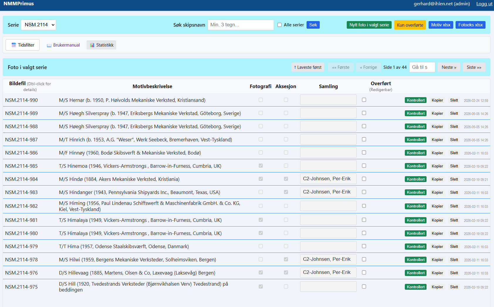
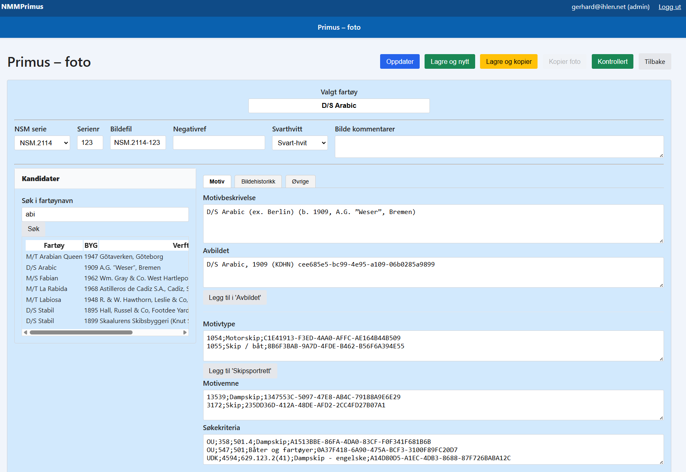
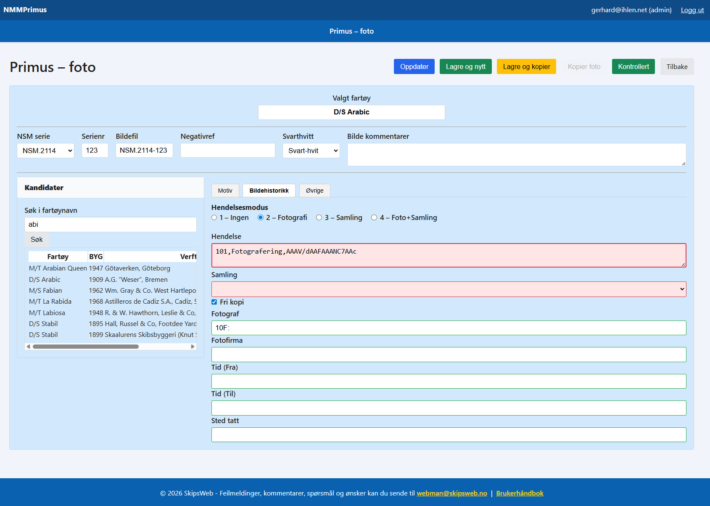
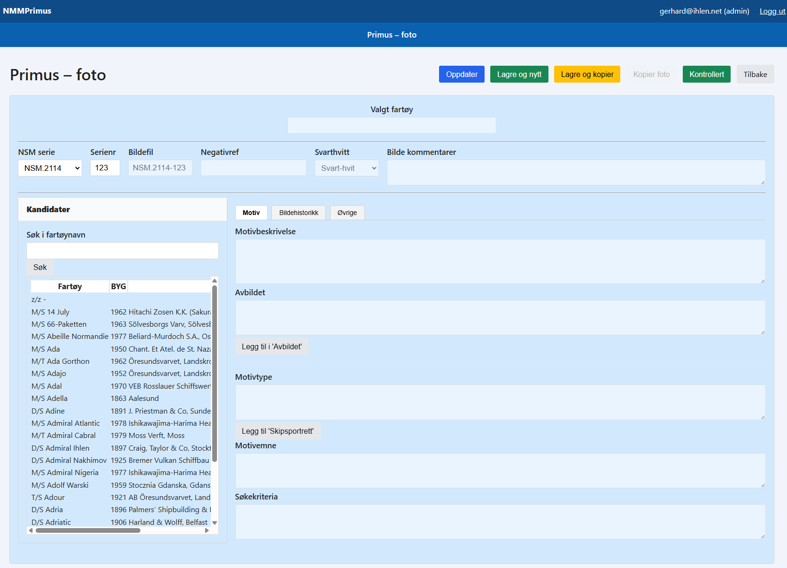

# NMMPrimus Brukerhåndbok

**Versjon:** 2.0
**Dato:** 2026-05-06
**System:** NMMPrimus - Maritim fotoarkiv-forvaltning

---

## Innholdsfortegnelse

1. [Innledning](#1-innledning)
2. [Kom i gang](#2-kom-i-gang)
3. [Landingssiden (Hovedoversikt)](#3-landingssiden-hovedoversikt)
4. [Detaljvisning (Redigering av foto)](#4-detaljvisning-redigering-av-foto)
5. [Arbeidsflyt: Opprette nytt foto](#5-arbeidsflyt-opprette-nytt-foto)
6. [Arbeidsflyt: Redigere eksisterende foto](#6-arbeidsflyt-redigere-eksisterende-foto)
7. [Arbeidsflyt: Kopiere foto](#7-arbeidsflyt-kopiere-foto)
8. [Hendelsesmodus (iCh 1–4)](#8-hendelsesmodus-ich-1-4)
9. [Eksport til Excel (kun admin)](#9-eksport-til-excel-kun-admin)
10. [Brukeradministrasjon (kun admin)](#10-brukeradministrasjon-kun-admin)
11. [Ofte stilte spørsmål](#11-ofte-stilte-spørsmål)
12. [Feilsøking](#12-feilsøking)

---

## 1. Innledning

### Hva er NMMPrimus?

NMMPrimus er et webbasert system for forvaltning av Norsk Maritimt Museums fotoarkiv. Systemet erstatter den tidligere Microsoft Access-løsningen og gjør det mulig å:

- Registrere og katalogisere maritime fotografier
- Koble fotodata med fartøyinformasjon fra fartøyregisteret
- Organisere foto i bildeserier
- Spore bildehistorikk, fotografer og samlingsinformasjon
- Eksportere fotodata til Excel for videre behandling

### Roller

Systemet har to brukerroller:

- **Bruker**: Kan registrere, redigere og slette foto. Kan søke i fartøyregisteret.
- **Admin**: Har alle brukerrettigheter pluss tilgang til brukeradministrasjon og Excel-eksport.

---

## 2. Kom i gang

### Innlogging

1. Åpne NMMPrimus i nettleseren
2. Logg inn med din e-postadresse og passord
3. Huk av "Husk meg" hvis du vil forbli innlogget (anbefales ikke på delte datamaskiner)

### Førstegangshjelp

Når du logger inn første gang, kommer du til **Landingssiden** hvor du kan:

- Velge en bildeserie fra dropdown-menyen
- Se eksisterende foto i den valgte serien
- Opprette nye foto
- Slette eller redigere eksisterende foto

---

## 3. Landingssiden (Hovedoversikt)

*Førstesiden*

*Viktig: Merk at du er i riktig bildeserie. Dobbel-klikk på rad for å åpne for redigering*

### Verktøylinje

Øverst på siden finner du en tre-kolonne verktøylinje:

- **Venstre**: Valg av bildeserie
- **Midten**: Søk etter skipsnavn
- **Høyre**: Handlingsknapper (Nytt foto, og for admin: eksport og filter)

### Velge bildeserie

1. Øverst til venstre finner du en **dropdown-meny** med tilgjengelige bildeserier
2. Velg ønsket serie (f.eks. "NSM.9999")
3. Systemet husker din siste valgte serie til neste gang du logger inn

### Søke etter skipsnavn

1. I verktøylinjen finner du **"Søk skipsnavn"**-feltet
2. Skriv inn minimum **3 tegn** av skipsnavnet
3. Velg søkeområde:
   - **Uten avkrysning**: Søker kun i valgt serie
   - **"Alle serier" avkrysset**: Søker i alle bildeserier
4. Klikk **"Søk"**
5. Klikk **"Nullstill"** for å gå tilbake til normal serievisning

**Tips:** Søket finner delvis treff – "kong" finner "Kong Olav V", "Kongshavn" osv.

### Tidsfilter

Klikk **"📅 Tidsfilter"** for å utvide filterpanelet:

1. Velg felt å filtrere på: **Oppdatert tid** eller **Opprettet tid**
2. Angi **Fra dato** og/eller **Til dato**
3. Klikk **"Bruk filter"**
4. Aktivt filter vises med en "Aktiv"-markering på knappen
5. Klikk **"Nullstill"** for å fjerne filteret

### Fotoliste

Listen viser 15 foto per side med kolonnene:

- **Bildefil**: Unik ID (f.eks. "NSM.9999-001") – dobbeltklikk for å redigere
- **Motivbeskrivelse**
- **Fotografi**: Avkrysningsboks (skrivebeskyttet)
- **Aksesjon**: Avkrysningsboks (skrivebeskyttet)
- **Samling**: Tekstfelt (skrivebeskyttet)
- **Overført**: Checkbox for admin, tekst for vanlige brukere

### Sortering

Klikk **"↓ Høyeste først"** / **"↑ Laveste først"** for å bytte sorteringsrekkefølge på Bildefil. Valget huskes i sesjonen.

### Navigering (Paging)

- 15 foto vises per side
- Bruk **«« Første**, **« Forrige**, **Neste »**, **Siste »»** for å navigere
- Skriv sidenummer direkte i "Gå til side"-feltet og trykk Enter

### Handlinger per rad

#### Kontrollert
Klikk **"Kontrollert"** for å oppdatere tidsstempelet på raden (Oppdatert_Tid settes til nå). Nyttig for å dokumentere at raden er gjennomgått.

#### Kopier
Klikk **"Kopier"** for å lage en kopi av fotoet i samme serie. Kopien får nytt SerNr og åpnes i detaljvisning.

#### Slett
Klikk **"Slett"** og bekreft for å slette fotoet permanent. Du forblir på samme side etter sletting.

#### Opprette nytt foto
Klikk **"Nytt foto i valgt serie"** for å gå til detaljvisning i H2-modus (opprettelsesmodus).

#### Toggle Transferred (kun admin)
Klikk **checkbox** i Overført-kolonnen for å veksle status. Brukes for å markere foto som eksportert til arkivsystem.

### Statistikk (kun admin)

Klikk **"📊 Statistikk"** for å åpne statistikksiden med oversikt over nmmfoto-tabellen.

---

## 4. Detaljvisning (Redigering av foto)

*Fane for fartøy/fotodetaljer*

### Toppfelt

| Felt | Beskrivelse |
|------|-------------|
| **Valgt fartøy** | Fartøynavn (autofylt, ikke redigerbar) |
| **NSM serie** | 8-tegns serie-ID, valgbar fra dropdown |
| **Serienr** | Sekvensnummer 1–999 |
| **Bildefil** | Auto-generert: Serie-SerNr med ledende nuller (f.eks. "NSM.9999-042") |
| **Negativref** | Referanse negativnummer (hurtigtilgang) |
| **Svarthvitt** | Velg mellom Svart-hvit, Farge, Håndkolorert |
| **Bilde kommentarer** | FTO-felt fra fartøyregisteret (skrivebeskyttet) |

### Handlingsknapper

| Knapp | Funksjon |
|-------|----------|
| **Oppdater** | Lagrer alle endringer og returnerer til landingssiden |
| **Lagre og nytt** | Lagrer og åpner blankt skjema for nytt foto i samme serie |
| **Lagre og kopier** | Lagrer og oppretter en kopi med nytt SerNr |
| **Kopier foto** | Kopierer fotoet (kun tilgjengelig for lagrede rader med fartøy) |
| **Kontrollert** | Oppdaterer Oppdatert_Tid til nå og returnerer til landingssiden |
| **Tilbake** | Returnerer til sist besøkte side i landingssiden uten å lagre |

### Kandidatpanel (venstre)

- **H2-modus** (nytt foto): Klikk på en rad for å velge fartøy
- **H1-modus** (eksisterende foto): Klikk på en rad for å bytte fartøy (krever bekreftelse)
- Søk oppdateres med knappen **"Søk"** eller Enter

### Faner

#### Fane 1: Motiv

- **Motivbeskrivelse**: Hovedbeskrivelse (autofylles ved fartøyvalg)
- **Avbildet**: Sammendrag av fartøydata (autofylt)
  - Klikk **"Legg til i 'Avbildet'"** for å legge til ytterligere fartøy
- **Motivtype**: Multiline-felt (f.eks. "1060;Skipsportrett;...")
  - Klikk **"Legg til 'Skipsportrett'"** for rask tillegging
- **Motivemne**: Multiline-felt
- **Søkekriteria**: OU- og UDK-klassifikasjoner

#### Fane 2: Bildehistorikk

Øverst velger du **Hendelsesmodus** (se pkt. 8).

**Hendelse**: Fritekst-beskrivelse (alltid redigerbar)

**Samling** (kun i modus 3 eller 4):
- Velg fra dropdown eller skriv inn egendefinert verdi

**Fotoinformasjon** (kun i modus 2 eller 4):
- **Fotograf**, **Fotofirma**, **Tid (Fra)**, **Tid (Til)**, **Sted tatt**
- FotoTidTil arver automatisk verdien fra FotoTidFra hvis den er tom

**NB**: Felt som ikke er tillatt i valgt modus nullstilles i databasen ved lagring.

#### Fane 3: Øvrige

- **Referanse, NMM** / **Referanse, fotograf**
- **Plassering**, **Prosess**
- **Svarthvitt**, **Status**, **Tilstand**
- **Merknad**: Fritekst-notater

---

## 5. Arbeidsflyt: Opprette nytt foto

### Trinn 1: Start ny registrering
1. Velg ønsket **bildeserie** på landingssiden
2. Klikk **"Nytt foto i valgt serie"**
3. Du sendes til detaljvisning i **H2-modus**

### Trinn 2: Velg fartøy (obligatorisk)

1. I **kandidatpanelet til venstre**: Søk etter fartøynavn (min. 3 tegn)
2. Klikk **"Velg"** på ønsket fartøy
3. Systemet fyller automatisk ut: MotivBeskr, MotivType, MotivEmne, MotivKriteria, Avbildet

### Trinn 3: Velg hendelsesmodus
1. Gå til fanen **Bildehistorikk**
2. Velg riktig **hendelsesmodus** (1–4)
3. Standardmodus er **Ingen (iCh 1)** – endre til f.eks. **Fotografi (iCh 2)** for å fylle ut fotofelt

### Trinn 4: Fyll ut detaljer
- **Motiv**: Juster MotivBeskr, fyll inn Hendelse
- **Bildehistorikk**: Fotograf, FotoFirma, Tid, Sted, Samling (avhengig av modus)
- **Øvrige**: Tekniske felt og merknad

### Trinn 5: Lagre
1. Klikk **"Oppdater"** (eller **"Lagre og nytt"** for å fortsette med neste foto)
2. SerNr valideres (1–999) og Bilde_Fil genereres automatisk
3. Du returneres til landingssiden

**Tips**: SerNr foreslås automatisk som ditt siste SerNr i serien + 1.

---

## 6. Arbeidsflyt: Redigere eksisterende foto

### Trinn 1: Åpne fotoet
1. På landingssiden: **Dobbeltklikk** på raden
2. Du sendes til detaljvisning i **H1-modus**

### Trinn 2: Juster hendelsesmodus om nødvendig
- Velg riktig modus for å få tilgang til ønskede felt
- Felt som ikke er tillatt i valgt modus får visuell markering og nullstilles ved lagring

### Trinn 3: Rediger og lagre
1. Gjør endringer i de tre fanene
2. Klikk **"Oppdater"** for å lagre
3. Du returneres til den siden du kom fra i landingssiden (filtre og paginering bevares)

**Avbryt**: Klikk **"Tilbake"** for å returnere uten å lagre.

---

## 7. Arbeidsflyt: Kopiere foto

### Når brukes kopier?
Bruk kopier-funksjonen når du skal registrere flere foto med:
- Samme fartøy og motivbeskrivelse
- Men ulik bildehistorikk

### Fremgangsmåte fra detaljvisning

1. Åpne eksisterende foto (dobbeltklikk fra landingssiden)
2. Klikk **"Kopier foto"** (krever at fotoet er lagret med fartøy)
3. Bekreft kopieringen
4. Systemet:
   - Kopierer motivdata fra kildefotoet
   - Nullstiller: Fotograf, FotoFirma, FotoTidFra/Til, FotoSted, Samling, ReferFArk, ReferNeg
   - Setter FriKopi = 1
   - Genererer nytt SerNr
   - Åpner kopien for redigering
5. Fyll inn ny bildehistorikk og klikk **"Oppdater"**

### Alternativ: Lagre og kopier

Klikk **"Lagre og kopier"** for å lagre gjeldende foto og umiddelbart opprette en kopi. Praktisk ved serieregistrering.

### Kopier fra landingssiden

Klikk **"Kopier"**-knappen på en rad i landingssiden for å kopiere direkte uten å åpne fotoet.

---

## 8. Hendelsesmodus (iCh 1–4)

### Hva er hendelsesmodus?

Hendelsesmodus styrer hvilke felt som er redigerbare i Bildehistorikk-fanen, og hvilke felt som skrives til databasen ved lagring.

### Modusene

| Modus | Navn | Foto-felt | Samling-felt |
|-------|------|-----------|--------------|
| **1** | Ingen | ❌ Nullstilles | ❌ Nullstilles |
| **2** | Fotografi | ✅ Redigerbare | ❌ Nullstilles |
| **3** | Samling | ❌ Nullstilles | ✅ Redigerbar |
| **4** | Foto + Samling | ✅ Redigerbare | ✅ Redigerbar |

**Aksesjon** og **Fotografi**-checkboxene settes automatisk basert på valgt modus – de er ikke manuelt redigerbare.

### Visuell markering

- **Grønn ramme**: Feltet er redigerbart og vil lagres
- **Rød ramme**: Feltet er ikke redigerbart – eksisterende verdi nullstilles ved lagring

### Bytte modus

1. Gå til **Bildehistorikk**-fanen
2. Velg ønsket modus med radioknappene
3. Feltene oppdaterer farge umiddelbart
4. Klikk **"Oppdater"** for å lagre med ny modus

**NB**: Ved modusskifte nullstilles feltene som ikke tilhører ny modus. F.eks. ved skifte fra modus 3 til modus 1 slettes Samling fra databasen.

---

## 9. Eksport til Excel (kun admin)

### Tilgang
Kun brukere med **admin-rolle** har tilgang til Excel-eksport.

### Motiv xlsx – eksport av uoverførte foto

Brukes for å eksportere foto som ennå ikke er overført til arkivsystemet.

1. Klikk **"Motiv xlsx"** i verktøylinjen
2. Fyll inn **SerNr fra** og **SerNr til** (maks 1000 poster)
3. Klikk **"Eksporter"** – Excel-fil lastes ned
4. Etter vellykket eksport: marker foto som overført via **"Toggle Transferred"**

**Eksporterte felt:** BildeId, URL_Bane, MotivBeskr, MotivType, MotivEmne, MotivKriteria, Svarthvitt, Aksesjon, Samling, Fotografi, FotoFirma, Foto_Fra, Foto_Til, FotoSted, Prosess, Referansenr, FotografsRefNr, Plassering, Status, Tilstand, FriKopi, Fart_UUID, Merknad

### Fotoeks xlsx – eksport av overførte foto

Brukes for å eksportere foto som allerede er markert som overført (Transferred = Ja).

1. Klikk **"Fotoeks xlsx"**
2. Fyll inn SerNr-område
3. Klikk **"Eksporter"**

### Toggle Transferred (kun admin)

- Klikk **checkbox** i Overført-kolonnen på en rad for å veksle status
- Klikk **"Kun overførte"** for å filtrere og kun vise overførte rader
- Klikk **"Vis alle"** for å fjerne filteret

---

## 10. Brukeradministrasjon (kun admin)

### Tilgang
Kun brukere med **admin-rolle** har tilgang til brukeradministrasjon.

### Opprett ny bruker

1. Klikk **"Brukeradministrasjon"** i menyen
2. Klikk **"Opprett ny bruker"**
3. Fyll inn e-postadresse, passord (min. 6 tegn) og rolle
4. Klikk **"Opprett bruker"**

### Rediger bruker

1. Finn brukeren i listen og klikk **"Rediger"**
2. Endre e-postadresse og/eller rolle
3. Klikk **"Lagre endringer"**

### Endre passord

1. Finn brukeren og klikk **"Endre passord"**
2. Skriv inn nytt passord (min. 6 tegn)
3. Klikk **"Oppdater passord"**

### Deaktivere / aktivere bruker

Klikk **"Deaktiver"** eller **"Aktiver"** ved siden av brukeren. Deaktiverte brukere kan ikke logge inn.

### Slette bruker

Klikk **"Slett"** og bekreft. Sletting er permanent.

---

## 11. Ofte stilte spørsmål

### Hvorfor foreslås SerNr 2 i stedet for 1 i en tom serie?

Systemet foreslår ditt **siste SerNr i serien + 1**. Hvis du aldri har registrert i serien, foreslås SerNr 1. Nummeret sjekkes mot eksisterende rader, og første ledige foreslås.

### Hvorfor forsvinner feltene mine når jeg bytter hendelsesmodus?

Felt som ikke tilhører valgt modus nullstilles i databasen ved lagring. Dette er tilsiktet atferd for å sikre datakonsistens. Bytt tilbake til riktig modus før du lagrer hvis du vil beholde verdiene.

### Hvorfor kan jeg ikke redigere Fotograf-feltet?

Fotograf er kun redigerbart i hendelsesmodus **2 eller 4**. Velg riktig modus i Bildehistorikk-fanen.

### Hvordan endre SerNr på et eksisterende foto?

1. Åpne fotoet
2. Endre **Serienr**-feltet øverst
3. Klikk **"Oppdater"** – Bilde_Fil oppdateres automatisk

### Hvorfor får jeg "Du må velge et fartøy"-feilmelding?

Du prøver å lagre uten at fartøy er valgt. Søk i kandidatpanelet til venstre og klikk "Velg" på ønsket fartøy.

### Kan FotoTidTil fylles ut automatisk?

Ja. Fyll inn **FotoTidFra** og trykk Enter eller klikk utenfor feltet – FotoTidTil arver verdien hvis den er tom.

### Kan jeg angre sletting?

Nei. Sletting er permanent. Vær sikker før du sletter.

### Hva betyr "Transferred"?

Viser om fotoet er eksportert til arkivsystemet. Kun admin kan endre denne statusen via Overført-checkboxen i landingssiden.

### Tilbake-knappen sender meg til feil side

Tilbake-knappen returnerer til sist besøkte side i landingssiden, inkludert alle filtre, søk og paginering. Hvis du ble sendt til en annen side i mellomtiden, kan siden avvike.

---

## 12. Feilsøking

### Jeg kan ikke logge inn

1. Sjekk at e-postadresse og passord er korrekt
2. Kontakt admin for å sjekke om brukeren er aktiv
3. Sjekk at nettleseren tillater cookies

### Siden ser rar ut (mangler CSS)

BASE_URL er feil konfigurert. Kontakt systemadministrator.

### "Kan ikke koble til database"

MySQL-tjenesten er ikke startet (lokalt). Start XAMPP og MySQL-tjenesten.

### Hvit side / 500-feil

Syntaksfeil i PHP-kode eller feil databasekonfigurasjon. Sjekk feillogg eller kontakt systemadministrator.

### SerNr hopper til uventede nummer

Systemet søker fra ditt forrige SerNr til 999, deretter fra 1 – og velger første ledige. Hvis mange nummer er i bruk, kan forslaget virke overraskende. Du kan alltid endre SerNr manuelt.

### Jeg mister sesjon / blir logget ut

1. Huk av **"Husk meg"** ved innlogging
2. Sjekk at nettleseren tillater cookies
3. Kontakt systemadministrator hvis problemet vedvarer

---

## Kontakt og support

**E-post**: webman@skipsweb.no

**Rapporter feil**: Kontakt systemadministrator eller webmaster

---

**Versjon:** 2.0
**Sist oppdatert:** 2026-05-06
